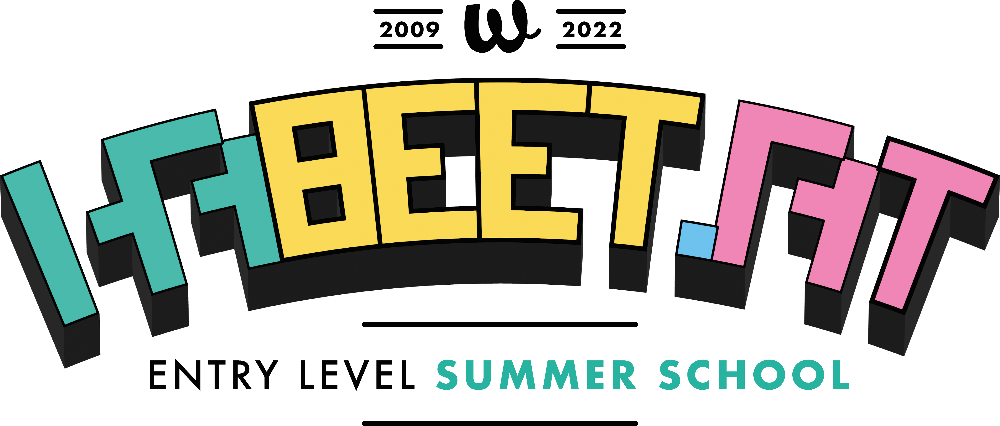

# Habeetat - Node.js in Pillole

<div style="text-align: center">
  
</div>

## Ciao

Il motivo per cui ho deciso di creare questa applicazione Next.js è quello di condividere la mia conoscenza su Node.js in modo totalmente libero.
Possono esserci degli errori, e sicuramente ce ne sono, quindi se li trovi o se qualcosa ti risulta poco chiaro, ti prego di sottomettere una PULL REQUEST 🙏.

Sai come creare siti e app nel browser con JavaScript? O forse hai esperienza con un linguaggio come Python, PHP o Ruby.
Indipendentemente da ciò, questo è il corso per chiunque voglia iniziare rapidamente con Node.js. 
Alcuni argomenti che tratteremo in questo corso includono:

* 😱 Introduzione a Node.js
* 👀 Moduli
* 🔥 File System
* 🎉 HTTP
* 🌊 Streams
* 💰 NPM
* 💸 Servers
* 🐆 Fastify
* ... E TANTO ALTRO ANCORA

## Eseguire il codice in locale

La prima cosa da fare è installare le dipendenze con il comando:

```bash
yarn install
```

Successivamente lancia uno dei comandi riportati di seguito

```bash
npm run dev

# oppure

yarn dev
```

Apri il browser all'indirizzo [http://localhost:3000](http://localhost:3000) per vedere il risultato.

Puoi iniziare a modificare la pagina modificando `pages/index.js`. La pagina si aggiorna automaticamente mentre modifichi il file.
Tutti gli argomenti trattati e suddivisi per lezione puoi trovarli nella directory `lessons` in formato Markdown.

## Argomenti da aggiungere

* Event Loop
* Testing (Assert, tapjs, jest)

## Licenza

[Creative Commons Legal Code](./LICENSE).